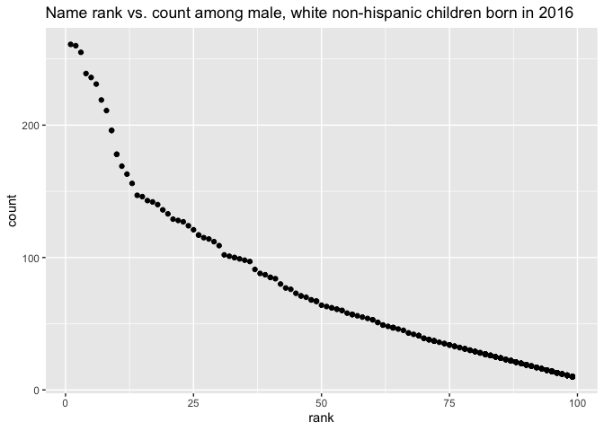

p8105\_hw2\_rac2224
================
Rachel Crowley
10/3/2019

## Problem 1

Reading and cleaning the Mr. Trash Wheel
    dataset

``` r
library(tidyverse)
```

    ## ── Attaching packages ────────────────────────────────────────────────────────────────────────── tidyverse 1.2.1.9000 ──

    ## ✔ ggplot2 3.2.1          ✔ purrr   0.3.2     
    ## ✔ tibble  2.1.3          ✔ dplyr   0.8.3     
    ## ✔ tidyr   1.0.0.9000     ✔ stringr 1.4.0     
    ## ✔ readr   1.3.1          ✔ forcats 0.4.0

    ## ── Conflicts ────────────────────────────────────────────────────────────────────────────────── tidyverse_conflicts() ──
    ## ✖ dplyr::filter() masks stats::filter()
    ## ✖ dplyr::lag()    masks stats::lag()

``` r
library(readxl)
library(knitr)
trash_data = read_excel("./data/Trashwheel.xlsx", sheet = 1, range = "A2:N408",   col_types =   NULL) 
  trash_data = janitor::clean_names(trash_data) 
  trash_data = drop_na(trash_data, dumpster) 
  trash_data = mutate(trash_data, 
                      sports_balls = round(sports_balls, digits = 0)) 
  as.integer(pull(trash_data, sports_balls))
```

    ##   [1]  7  5  6  6  7  5  3  6  6  7  6  8  6  6  6  6  5  6  6  7  6  6  6
    ##  [24]  5  6  7  8  7  4  7  3  6  6  6  7  6  6  6  7  6  6  7  6  6  7  6
    ##  [47]  5  3  8 16 14 13 16  8  5  8 11  7  6  8 22 28 19 32 24 26 36 24  9
    ##  [70] 16 22 17 13 14 21 15 13 18 16 22 32 18 21 34 19 14 22 16 25 27 18 20
    ##  [93] 17 56 32 22  6  3 17 13 12  7  8 16 23 33 27 15 21  9 13 22 17 27  8
    ## [116] 17 14 21 26  6  4 16 24 23 18 46 38 24 36 42 23 34 38 26 32 43 38 24
    ## [139] 35 26 29 31 28 34 26 38 25 16 24 15 31 22 28 32 15 28 33 11 37 22 11
    ## [162] 34  6 24 20 15 22 19 12 14 18 10  6  8  8  5  3  5  7  2  7  3  4  5
    ## [185]  8 10  5  7  5  8 10 11 14 12  8  5  9  5 14 12  8  7 18 11 22 13 21
    ## [208] 14  9  6 13 11  6  8  5  6 12  8  7 13 11 12  8  6  4  6 12 14  5  4
    ## [231]  8  3  7 10 12  1  4  2  4  3  4  3  4  2  5  1  3  2  4  2  3  4  5
    ## [254]  3  2  3  0  2  3  2  1  2  5  4  3  2  4  2  8  3  2  2  3  1  5  3
    ## [277]  1  2  7  4  5  1  7  2  3  6  1  9  0  2 14 11  6  0  4  9 16 14  8
    ## [300]  8 11  6  4  0  4  9 14  2  0  6  8  8  0  4 13 17  2 11 14  9  0  6
    ## [323]  6  3 11 14  4  8  1  4  8 14  9  4  4 14 22  6  9 10  8 17  8 16

Reading and cleaning precipitation datasets for 2017 and
2018

``` r
prec2018_data = read_excel("./data/Trashwheel.xlsx", sheet = 5, range =           "A2:B14", col_types = NULL)
  prec2018_data = janitor::clean_names(prec2018_data)
  prec2018_data = mutate(prec2018_data,
                         year = "2018")
prec2017_data = read_excel("./data/Trashwheel.xlsx", sheet = 6, range =           "A2:B14", col_types = NULL)
  prec2017_data = janitor::clean_names(prec2017_data)
  prec2017_data = mutate(prec2017_data,
                         year = "2017")
```

Combining precipitation datasets and converting month to character
variable

``` r
precip_data = 
  full_join(prec2017_data, prec2018_data)
```

    ## Joining, by = c("month", "total", "year")

``` r
precip_data = transform(precip_data, month = month.name)
```

  - The number of observations in the dataset precip\_data is 24. The
    number of observations in the dataset trash\_data is 344.Within the
    dataset precip\_data, key variables include month, total, year.
    Within the dataset trash\_data, key variables include chip\_bags,
    cigarette\_butts, date, dumpster, glass\_bottles, grocery\_bags,
    homes\_powered, month, plastic\_bottles, polystyrene, sports\_balls,
    volume\_cubic\_yards, weight\_tons, year.The total precipitation in
    2018 is 70.33. The median number of sports balls in a dumpster in
    2017 is 8.

## Problem 2

Cleaning data in FiveThirtyEight

Cleaning pols-month dataset

``` r
polsmonth_data=read_csv(file = "./data/pols-month.csv")
```

    ## Parsed with column specification:
    ## cols(
    ##   mon = col_date(format = ""),
    ##   prez_gop = col_double(),
    ##   gov_gop = col_double(),
    ##   sen_gop = col_double(),
    ##   rep_gop = col_double(),
    ##   prez_dem = col_double(),
    ##   gov_dem = col_double(),
    ##   sen_dem = col_double(),
    ##   rep_dem = col_double()
    ## )

``` r
polsmonth_data = janitor::clean_names(polsmonth_data)
polsmonth_data = separate(polsmonth_data, 
  mon, into=c("year", "month","day"))
polsmonth_data = mutate(polsmonth_data, month=month.name[as.integer(month)]) 
polsmonth_data = mutate(polsmonth_data, president = prez_gop + prez_dem) %>%
  select( -prez_gop, -prez_dem, -day)  
```

Cleaning snp dataset

``` r
snp_data=read_csv(file = "./data/snp.csv")
```

    ## Parsed with column specification:
    ## cols(
    ##   date = col_character(),
    ##   close = col_double()
    ## )

``` r
snp_data = janitor::clean_names(snp_data)
snp_data = separate(snp_data, 
  date, into=c("month", "day","year"))
snp_data = mutate(snp_data, month=month.name[as.integer(month)]) %>%
  select(-day) 
snp_data = select(snp_data, year, month, everything())
snp_data = head(arrange(snp_data, year, month), 787)
```

Cleaning unemployment dataset

``` r
unemployment_data=read_csv(file = "./data/unemployment.csv")
```

    ## Parsed with column specification:
    ## cols(
    ##   Year = col_double(),
    ##   Jan = col_double(),
    ##   Feb = col_double(),
    ##   Mar = col_double(),
    ##   Apr = col_double(),
    ##   May = col_double(),
    ##   Jun = col_double(),
    ##   Jul = col_double(),
    ##   Aug = col_double(),
    ##   Sep = col_double(),
    ##   Oct = col_double(),
    ##   Nov = col_double(),
    ##   Dec = col_double()
    ## )

``` r
unemployment_data = janitor::clean_names(unemployment_data)
unemployment_data = 
    pivot_longer(
    unemployment_data,
    jan:dec,
    names_to = "month",
    values_to = "unemployment")
unemployment_data = transform(unemployment_data, month = month.name)
```

Merging snp, employment, and pols datasets

``` r
unemployment_data <- unemployment_data %>%  
  mutate(year = as.character(year))
polsnp_data =
  left_join(polsmonth_data, snp_data)
```

    ## Joining, by = c("year", "month")

``` r
merged_data = 
  left_join(polsnp_data, unemployment_data)
```

    ## Joining, by = c("year", "month")

  - The polsmonth dataset has the following range of years: a minimum
    year of 1947 and a maximum year of 2015. The dimensions of the
    polsmonth dataset are 822, 9. In terms of key variables, within the
    dataset polsmonth the following key variables were present:
    gov\_dem, gov\_gop, month, president, rep\_dem, rep\_gop, sen\_dem,
    sen\_gop, year.

  - The snp dataset has the following range of years: a minimum year of
    1950 and a maximum year of 2015. The dimensions of the snp dataset
    are 787, 3. The following key variables were present within the snp
    dataset: close, month, year.

  - The unemployment dataset has the following range of years: a minimum
    year of 1948 and a maximum year of 2015.The dimensions of the
    unemployment dataset are 816, 3. The following key variables were
    present within the unemployment dataset: month, unemployment, year.

  - The resulting dataset, merged\_data, has the following range of
    years: a minimum year of 1947 to a maximum year of 2015. The
    dimensions of the resulting dataset, merged\_data, are 822, 11. The
    following key variables were present within the resulting dataset,
    merged\_data: close, gov\_dem, gov\_gop, month, president, rep\_dem,
    rep\_gop, sen\_dem, sen\_gop, unemployment, year.

## Problem 3

Cleaning Popular Baby Names dataset

``` r
babynames_data=read_csv(file = "./data/Popular_Baby_Names.csv")
```

    ## Parsed with column specification:
    ## cols(
    ##   `Year of Birth` = col_double(),
    ##   Gender = col_character(),
    ##   Ethnicity = col_character(),
    ##   `Child's First Name` = col_character(),
    ##   Count = col_double(),
    ##   Rank = col_double()
    ## )

``` r
babynames_data = janitor::clean_names(babynames_data)
babynames_data = babynames_data %>% distinct()
babynames_data$ethnicity <- gsub("BLACK NON HISPANIC", "BLACK NON HISP", babynames_data$ethnicity)
babynames_data$ethnicity <- gsub("WHITE NON HISPANIC", "WHITE NON HISP", babynames_data$ethnicity)
babynames_data$ethnicity <- gsub("ASIAN AND PACIFIC ISLANDER", "ASIAN AND PACI", babynames_data$ethnicity)
babynames_data= mutate(babynames_data, childs_first_name = str_to_title(childs_first_name))
```

Table for showing rank of popularity in name “Olivia” over
time

``` r
olivia_data =  babynames_data[which(babynames_data$childs_first_name=='Olivia'), 1:6]
olivia_data = head(arrange(olivia_data, year_of_birth), 24) %>%
  select(-gender, -count, -childs_first_name) 
olivia_data = 
  pivot_wider(
  olivia_data, 
  names_from = "year_of_birth", 
  values_from = "rank")
kable(olivia_data[1:4, ], format = "pandoc", caption = "Rank in popularity of name Olivia over time")
```

| ethnicity      | 2011 | 2012 | 2013 | 2014 | 2015 | 2016 |
| :------------- | ---: | ---: | ---: | ---: | ---: | ---: |
| ASIAN AND PACI |    4 |    3 |    3 |    1 |    1 |    1 |
| BLACK NON HISP |   10 |    8 |    6 |    8 |    4 |    8 |
| HISPANIC       |   18 |   22 |   22 |   16 |   16 |   13 |
| WHITE NON HISP |    2 |    4 |    1 |    1 |    1 |    1 |

Rank in popularity of name Olivia over time

Table for most popular name among male children over
time

``` r
male_data = babynames_data[which(babynames_data$gender=='MALE' & babynames_data$rank=="1"), 1:6]
male_data = head(arrange(male_data, year_of_birth), 5962) %>%
    select(-gender, -count, -rank) 
male_data = 
  pivot_wider(
male_data, 
  names_from = "year_of_birth", 
  values_from = "childs_first_name")
kable(male_data[1:4,], format = "pandoc", caption = "Most popular name among male children over time")
```

| ethnicity      | 2011    | 2012   | 2013   | 2014   | 2015   | 2016   |
| :------------- | :------ | :----- | :----- | :----- | :----- | :----- |
| ASIAN AND PACI | Ethan   | Ryan   | Jayden | Jayden | Jayden | Ethan  |
| BLACK NON HISP | Jayden  | Jayden | Ethan  | Ethan  | Noah   | Noah   |
| HISPANIC       | Jayden  | Jayden | Jayden | Liam   | Liam   | Liam   |
| WHITE NON HISP | Michael | Joseph | David  | Joseph | David  | Joseph |

Most popular name among male children over time

Scatter plot for male, white non-hispanic children born in
2016

``` r
whitemale_data= babynames_data[which(babynames_data$gender=='MALE' & babynames_data$year_of_birth=="2016" & babynames_data$ethnicity=="WHITE NON HISP"), 1:6]
whitemale_plot = ggplot(whitemale_data, aes(x = rank, y = count)) +
  geom_point() + ggtitle("Name rank vs. count among male, white non-hispanic children born in 2016")
print(whitemale_plot)
```

<!-- -->

``` r
ggsave("whitemale_plot.png")
```

    ## Saving 7 x 5 in image
